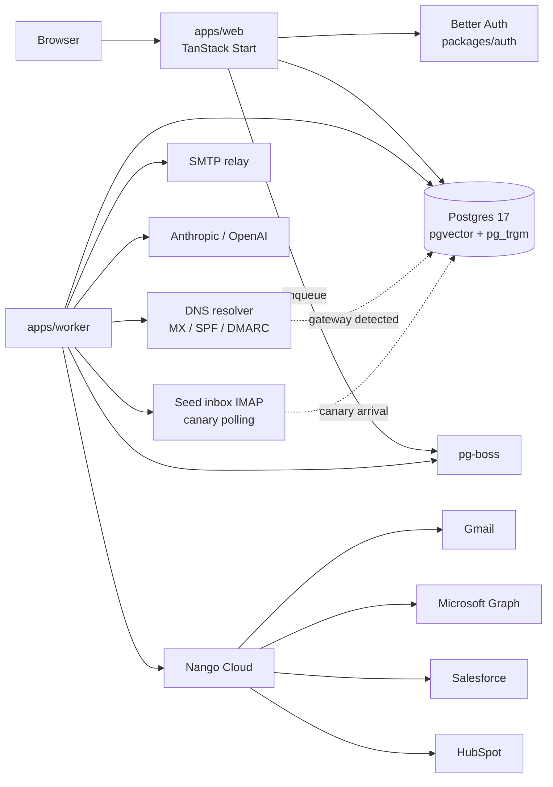

# Architecture

**Web** (`apps/web`) is a TanStack Start app: file-based routes, SSR, and data access
through typed server functions. Auth routes through Better Auth (`packages/auth`); every
data-touching server function composes `authMiddleware` (`src/lib/org-fn.ts`), which
injects `{ userId, organizationId, role }` — the tenancy chokepoint.

**Worker** (`apps/worker`) is a long-running Node process. It boots pg-boss, registers
job handlers (sequence scheduler, send adapters, mailbox poller, CRM sync, webhooks,
AI research, and the Phase 11 handlers: gateway detection, canary check, seed inbox
verify, deliverability snapshot), and shares the same Postgres schema and env
validation as the web app.

**Data** lives in Postgres 17 (`packages/db`, Drizzle ORM). Extensions: `vector` (AI
embeddings) and `pg_trgm` (prospect search). The queue is pg-boss — no Redis required.

**Integrations** go through Nango (`packages/integrations`): OAuth for mailboxes and
CRMs, proxy calls for Gmail/Graph send, and sync models for Salesforce/HubSpot.
**Mail** (`packages/mail`) builds MIME, threading headers, and CAN-SPAM footers;
adapters wrap Nango (Gmail/Microsoft) or raw SMTP. **Gateway detection**
(`packages/mail/src/gateway-detect.ts`) resolves recipient MX records against a
fingerprint table to identify SEGs.

**Core** (`packages/core`) is pure domain logic (no I/O): the enrollment state machine
(`transition` → `nextState + effects[]`), schedule/window/throttle math, entry
conditions with gateway predicates, and deliverability helpers (`mailbox-safety`,
`auto-pause`) shared by web + worker.

**AI** (`packages/ai`) handles the research pipeline (web search + summarize with
`research_profile` cache), grounded generation via `generateText`, humanization, and
inbound sentiment classification. Model providers are pluggable (Anthropic / OpenAI).

**Enterprise deliverability** — see [deliverability.md](./deliverability.md) for the
Phase 11 detection + routing + canary system.

For package-level detail and phase history, see [CLAUDE.md](../CLAUDE.md).
