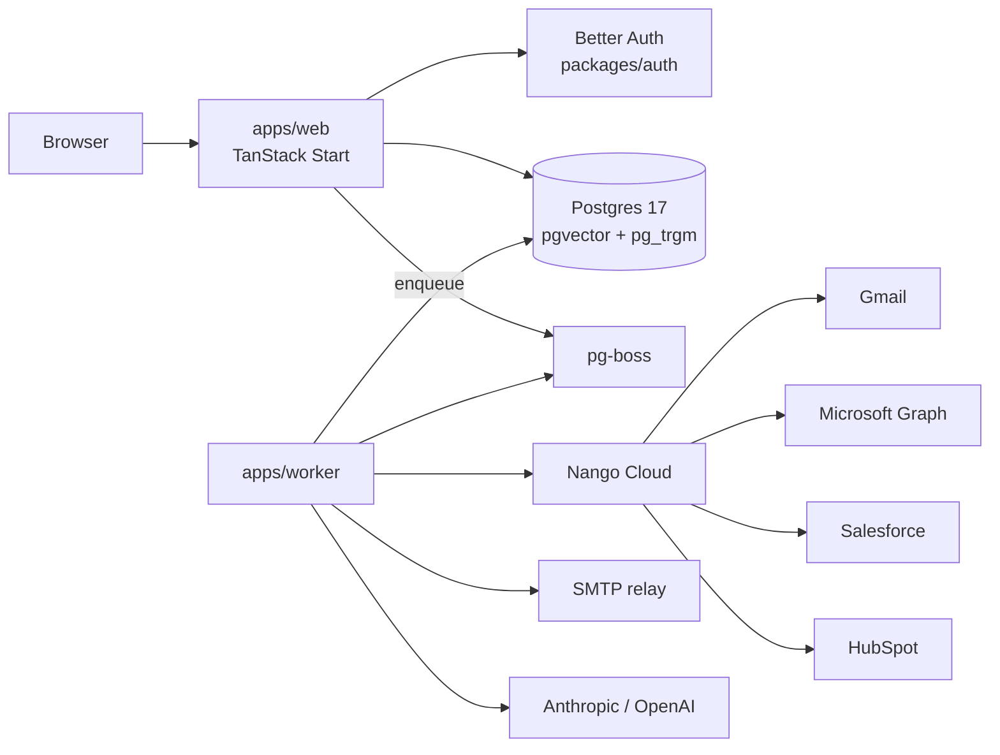

# Architecture

**Web** (`apps/web`) is a TanStack Start app: file-based routes, SSR, and data access
through typed server functions. Auth routes through Better Auth (`packages/auth`); every
data-touching server function composes `authMiddleware` (`src/lib/org-fn.ts`), which
injects `{ userId, organizationId, role }` — the tenancy chokepoint.

**Worker** (`apps/worker`) is a long-running Node process. It boots pg-boss, registers
job handlers (sequence scheduler, send adapters, mailbox poller, CRM sync, webhooks,
AI research), and shares the same Postgres schema and env validation as the web app.

**Data** lives in Postgres 17 (`packages/db`, Drizzle ORM). Extensions: `vector` (AI
embeddings) and `pg_trgm` (prospect search). The queue is pg-boss — no Redis required.

**Integrations** go through Nango (`packages/integrations`): OAuth for mailboxes and
CRMs, proxy calls for Gmail/Graph send, and sync models for Salesforce/HubSpot.
**Mail** (`packages/mail`) builds MIME, threading headers, and CAN-SPAM footers; adapters
wrap Nango (Gmail/Microsoft) or raw SMTP.

For package-level detail and phase history, see [CLAUDE.md](../CLAUDE.md).
