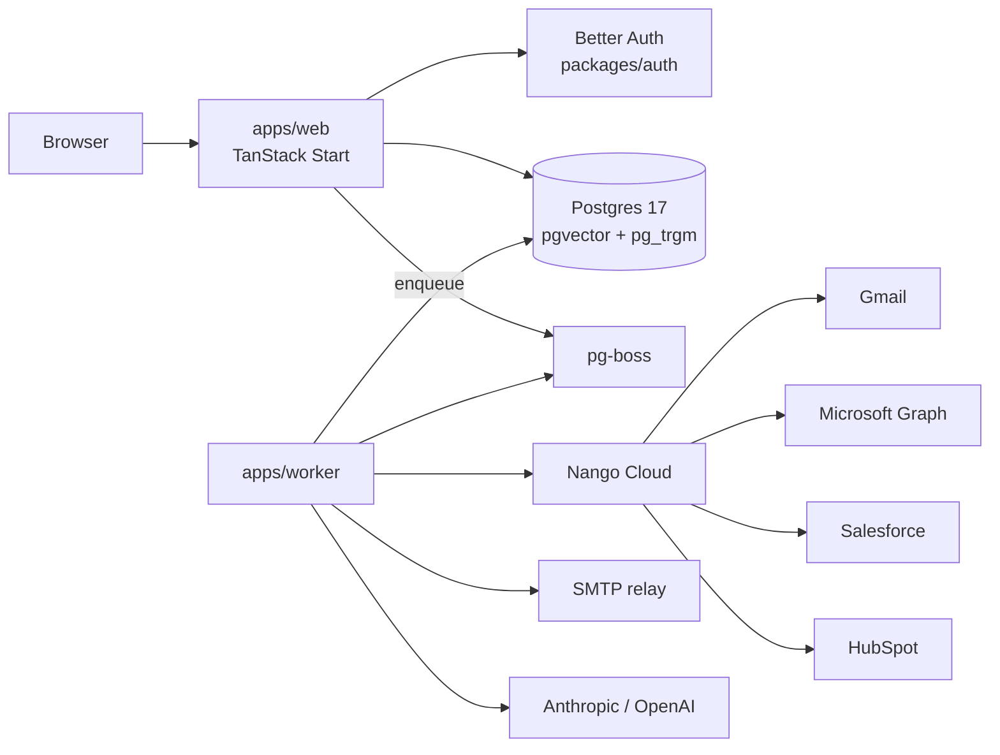

# TRACK PSI — Real-User Documentation

## Repo
`/Users/beckett/Projects/quik-ideas/quiksend`

## Branch
`docs/wave6-psi` from `main` (worktree isolated).

## Context (read in order)
1. `CLAUDE.md`
2. `wave6/WAVE_CONTEXT.md`
3. `README.md` — current state (needs rewrite for real users)
4. `docs/self-host.md` — stub from EPSILON; fill it out
5. `docker-compose.yml` — dev infra reference
6. `RELEASING.md` — how releases are cut (link from README)
7. `packages/db/src/seed.ts` (or `scripts/*seed*`) — the demo seed
8. `packages/mail/src/adapters/gmail.ts`, `microsoft.ts` — Nango provider config
9. `apps/web/src/routes/_protected/settings/mailboxes/**` — mailbox onboarding UI
10. `packages/config/src/env.schema.ts` — env vars a self-hoster needs

## Findings addressed
- **COMP-012 LOW** — README intro stale
- Plus the general "docs for real users" gap identified in the roadmap conversation

## Documentation lookup (mandatory)
- **Nango Cloud** — provider configuration for Gmail + Microsoft: scopes, redirect
  URIs, connect UI setup. Use Context7 MCP with `@nangohq/node` or `@nangohq/frontend`.
- **Cloudflare / Fly / Docker** — deployment platform patterns (pick one canonical
  path — Docker Compose is simplest; document that)

## Tasks

### T1 — Rewrite `README.md`

Structure:
```
# Quiksend
<one-line pitch: open-source, self-hosted sales engagement platform>
<short: AI-personalized email sequences with Salesforce + HubSpot writeback>

## Why Quiksend
- Compare to Outreach.io / Salesforge.ai: we're self-hostable, source-visible,
  and integrated with 250+ CRMs via Nango
- 3 sentences on positioning

## Get started
### Prerequisites
- Node 24.18+, pnpm 11.9+, Docker + Docker Compose
- (Optional) Nango Cloud account for Gmail/Microsoft OAuth
- (Optional) Anthropic or OpenAI API key for AI-personalized generation

### 5-minute local demo
1. `git clone …`
2. `pnpm install`
3. `cp .env.example .env` and set at least `BETTER_AUTH_SECRET`
4. `docker compose up -d` (Postgres + Mailpit)
5. `pnpm db:migrate`
6. `pnpm db:seed` (creates a demo org, mailbox, sequence, 20 prospects)
7. `pnpm web:dev` → open http://localhost:3000
8. Log in with the seed credentials shown in terminal
9. Send a sequence — messages land in Mailpit (http://localhost:8025)

### Self-hosting
See [docs/self-host.md](docs/self-host.md) for production deployment.

## Features
- Manual-first → auto follow-up (Gmail + Microsoft + SMTP)
- AI research + generation grounded in web + CRM context
- Salesforce + HubSpot bi-directional sync via Nango
- Unified inbox with sentiment classification
- Public REST API + outbound webhooks
- Multi-tenant workspaces from day one

## Architecture
Brief pointer to docs/architecture.md (create if missing — TBD) or CLAUDE.md.
Diagram: apps/web (TanStack Start) + apps/worker + Postgres + Nango.

## Contributing
Link to CLAUDE.md conventions, RELEASING.md for releases.

## License
Link to LICENSE.
```

Keep it under ~150 lines. Delete the current README's redundant sections. Point to
`docs/*` for depth.

### T2 — Fill out `docs/self-host.md`

Sections:

```markdown
# Self-hosting Quiksend

## Deployment options
- **Docker Compose** (recommended for < 100 workspaces) — a Compose file with web + worker + Postgres + Mailpit (dev) or an external SMTP provider (prod)
- **Kubernetes / cloud VM** — high-level guidance, not a runbook

## Prerequisites
- Postgres 17 with pgvector + pg_trgm extensions
- Node 24.18+
- (Required for OAuth mailboxes) Nango Cloud account
- (Required for AI features) Anthropic OR OpenAI API key
- SMTP relay (or Gmail/Microsoft via OAuth) for outbound mail

## Environment variables (production)
Table of required + optional. Point to `.env.example` for the full list.
Required in production per `env.schema.ts` refine:
- BETTER_AUTH_SECRET (≥32 bytes; `openssl rand -base64 32`)
- BETTER_AUTH_URL
- DATABASE_URL
- NANGO_WEBHOOK_SECRET (once any OAuth mailbox connected)
- MAILBOX_ENCRYPTION_KEY (once any SMTP mailbox connected; `openssl rand -base64 32`)
- UNSUBSCRIBE_TOKEN_SECRET

Optional but recommended:
- SENTRY_DSN, POSTHOG_KEY

## Docker Compose recipe
Full `docker-compose.prod.yml` snippet:
- web (GHCR image whrit/quiksend-web:latest)
- worker (GHCR image whrit/quiksend-worker:latest)
- Postgres 17 (pgvector/pgvector:pg17)
- Optional: Mailpit for testing OR link to external SMTP

Verify — user should be able to copy-paste this and get running.

## First-run setup
1. Migrate: `docker compose exec web pnpm db:migrate`
2. Sign up the first admin via `/login` (email + password)
3. Create a workspace (the first workspace becomes the primary)
4. (Optional) Configure Nango — see [Nango setup](#nango-setup)
5. Connect a mailbox (Settings → Mailboxes)
6. Import prospects (CSV or CRM sync)

## Nango setup
Step-by-step for Gmail + Microsoft:
1. Sign up at nango.dev (or self-host Nango)
2. Create providers for `google-mail` + `microsoft-graph`
3. Set OAuth scopes:
   - Gmail: `https://www.googleapis.com/auth/gmail.send`,
     `https://www.googleapis.com/auth/gmail.readonly`
   - Microsoft: `Mail.Send`, `Mail.Read`, `offline_access`
4. Set redirect URI in Google / Microsoft consoles to Nango's callback URL
5. In Quiksend: paste `NANGO_SECRET_KEY` + `NANGO_WEBHOOK_SECRET` into env
6. In Quiksend UI Settings → Mailboxes, click "Connect Gmail" — Nango handles OAuth flow

## Salesforce / HubSpot setup
Similar step-by-step. Point to Nango's provider config docs.

## Backups
- Postgres dump `pg_dump quiksend > backup.sql` (recommended daily)
- Mailbox refresh tokens live encrypted in `mailbox.smtp_config` (jsonb) — including
  the SQL dump preserves them

## Upgrades
- Pull the new GHCR tag
- Run migrations: `docker compose exec web pnpm db:migrate`
- Restart the worker last

## Common operational failures

### Mailbox lost auth
Symptom: `mailbox.status = 'auth_required'`
Fix: In Settings → Mailboxes, click "Reconnect"

### Worker OOM
Symptom: workers restart repeatedly; enrollments stuck at `next_run_at` in the past
Fix:
- Raise Node heap: `NODE_OPTIONS=--max-old-space-size=2048`
- Reduce load-test-engine batch size if you're running the load test in prod

### Database at connection limit
Symptom: `remaining connection slots are reserved` errors in logs
Fix:
- Use PgBouncer with `DATABASE_POOLER_MODE=transaction` in env
- Reduce worker count via `WORKER_CONCURRENCY` env

### High latency on prospect list
Symptom: `/prospects` slow, `EXPLAIN` shows seq scan
Fix: Confirm `pg_trgm` extension is installed (`CREATE EXTENSION pg_trgm;` — the wave5
migration does this). If missing, run `pnpm db:migrate` again.

## Getting help
- GitHub issues: https://github.com/whrit/Quiksend/issues
- Discord: TBD
```

### T3 — Add `docs/architecture.md` (short)

10–20 line diagram + prose overview:


Prose: "Web is TanStack Start (SSR + server-fns). Worker runs the scheduler +
adapters + poller as separate processes. Everything is Postgres — schema in
`packages/db`. Multi-tenancy is enforced at the server-fn boundary via `orgFn`
middleware."

### T4 — Add `docs/nango-setup.md` (deeper Nango guide)

Extract the Nango section from self-host.md into its own file with screenshots
placeholders (`![screenshot: Nango providers page]`). Users referencing this from
their onboarding will link here.

### T5 — Add `docs/troubleshooting.md`

A runbook that expands the "Common operational failures" section. One page per
failure mode:
- Symptoms → Diagnosis → Fix
- Include the SQL queries you'd run to diagnose (e.g. `SELECT count(*) FROM enrollment WHERE state='active' AND next_run_at < now() - interval '15 minutes'`)

### T6 — Update RELEASING.md if needed

Only if there's drift from Wave 5 mechanics. Skim it; probably no changes needed.

## Files owned (strict)

- `README.md`
- `docs/self-host.md`
- `docs/architecture.md` — NEW
- `docs/nango-setup.md` — NEW
- `docs/troubleshooting.md` — NEW
- `RELEASING.md` (light touch only if needed)
- `docker-compose.prod.yml` — if you need to fix docs by fixing the file (optional)

## Do NOT touch

- Any `.ts`/`.tsx` file — pure docs track
- OMEGA's owned files

## Verification

```bash
pnpm install --frozen-lockfile
pnpm check   # docs-only changes shouldn't affect lint/typecheck/tests
```

Confirm every code example in your docs runs. Try `pnpm db:seed` yourself — does it
exist? If not, either implement it or drop that step from README (write it in
NEEDS.md if the seed doesn't exist yet).

Confirm the docker-compose recipe boots. Manual smoke test: fresh clone → follow
your own README from step 1 to step 9. If it doesn't work, fix the docs (or fix
the code with a NEEDS.md note).

## Result

```json
{
  "status": "ok",
  "track": "PSI",
  "findings_addressed": ["COMP-012"],
  "files_changed": [...],
  "docs_added": [...],
  "notes": "..."
}
```
